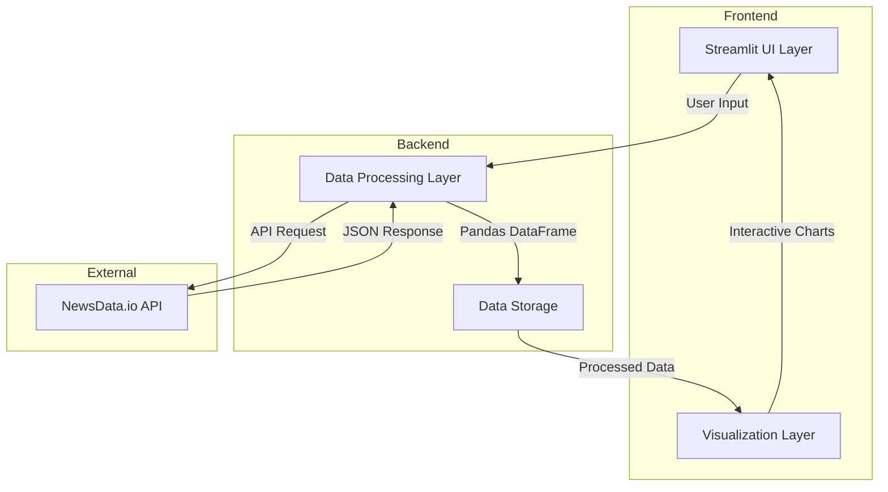

# News Intelligence Dashboard Architecture

## System Overview
The News Intelligence Dashboard is built on a modern, layered architecture that processes and visualizes news data in real-time. This document outlines the complete system architecture and the interaction between different components.

## Architecture Diagram

## Component Details

### Frontend Layer
The frontend consists of two main components:

1. **Streamlit UI Layer**
   - Handles user interactions and input collection
   - Provides responsive layout management
   - Renders interactive visualizations
   - Manages state and session data

2. **Visualization Layer**
   - Creates interactive charts using Plotly Express
   - Processes data for visual representation
   - Handles real-time updates
   - Manages chart interactions and events

### Backend Layer
The backend layer manages data processing and storage:

1. **Data Processing Layer**
   - Validates user input
   - Makes API requests to NewsData.io
   - Transforms raw JSON data into structured format
   - Handles error cases and edge conditions

2. **Data Storage Layer**
   - Maintains session-based data storage
   - Manages DataFrame operations
   - Handles data caching
   - Provides data access patterns

### External Services
The system integrates with:

1. **NewsData.io API**
   - Provides raw news data
   - Handles authentication
   - Manages rate limiting
   - Supports pagination

## Data Flow

1. **Input Processing**
   - User enters search parameters
   - System validates input
   - Parameters are formatted for API request

2. **Data Retrieval**
   - System sends request to NewsData.io
   - Handles pagination for large datasets
   - Processes API response
   - Transforms JSON to DataFrame

3. **Data Analysis**
   - Analyzes sentiment patterns
   - Processes temporal data
   - Aggregates regional information
   - Generates statistical summaries

4. **Visualization**
   - Creates interactive charts
   - Updates real-time metrics
   - Renders data tables
   - Handles user interactions

## Implementation Notes

### Key Technologies
- **Streamlit**: Frontend framework
- **Pandas**: Data processing
- **Plotly Express**: Data visualization
- **Python Requests**: API communication
